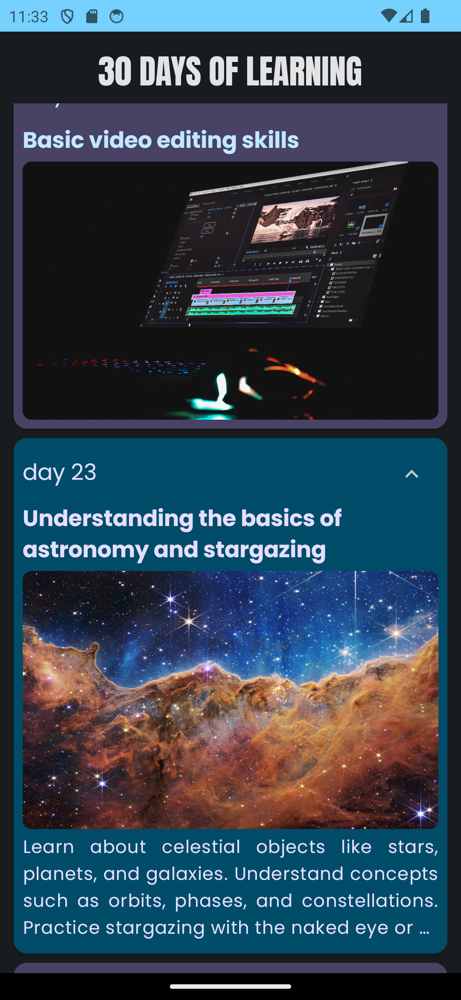
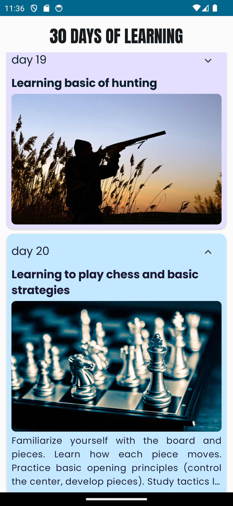

# 30 Days Learning

30 Days Learning is an Android app built with Jetpack Compose that aims to facilitate learning over a 30-day period. Each day is represented by a card displaying the day number in ascending order, along with a topic, related image, description, and an expand icon to view additional details.

## Features

- Displays a list of 30 cards, each representing a day of learning.
- Supports expandable cards for detailed descriptions.
- Content and color animations enhance user experience.
- Supports both dark and light themes, following Material 3 guidelines.
- Includes a logo for the app.


## Screenshots





## Technologies Used

- Kotlin
- Jetpack Compose
- Material 3

## Setup

1. **Clone the Repository**: 
   ```
   git clone https://github.com/IbrahimAlsaudi/30-days-learning.git
   ```
2. **Open in Android Studio**: 
   Open the project in Android Studio.
3. **Build and Run**: 
   Build the project and run it on an emulator or a physical device.

   

## Contributors


Contributions are welcome! If you'd like to contribute, please feel free to do so!

